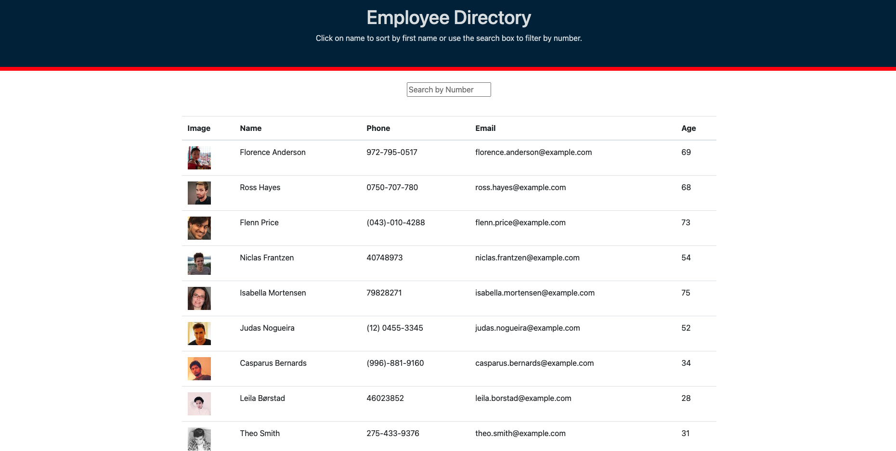

# employee-directory

## Table of Contents
* [Description](#description)
* [Installation](#installation)
* [Usage](#usage)
* [Contributing](#contribution)
* [Questions](#questions)
* [Screenshot](#screenshot)
* [Deployment](#deployment)
* [Credits](#credits)

## Description
employee-directory is an application for designed for you to view your employees in a quick and easy fashion.  

## Installation
Follow these steps to view the application!

1. Open link in (Github.) [https://github.com/xdanielmtz/employee-directory]
2. Clone with SSH Key
3. Run `git clone` command in Terminal with the pasted link
4. Run `code .` command to open in VS Code.
5. Run `npm install` to install all dependencies
6. Run `npm start` to initialize the server on your local if you wish to view it there.
7. Enjoy

## Usage
Upon entering the application, you will be greeted with a simple and clean design. Right away when the page loads you will see your 50 employees along with their image, name, phone, email, and their age.
You will see this data in the form of a table. If you click on the "Name" column, that will place the employees in order by alphabetical name. Also, you can search by number in the search bar. 

## Contribution
IF you wish to contribute, here is how:
GO to my repo and fork my repository.
CLONE with ssh and view it on your local machine.
WHEN you have made your contributions, run git push and I will review for a merge.

## Questions
If you have any questions contact me through email:
    (Daniel Martinez) - [xdanielmtz@gmail.com]

## Screenshot

## Deployment
https://xdanielmtz.github.io/employee-directory/
## Credits
I would like to give credits to my instructor, Jonathan Watson for providing me with the information needed to complete this assignment. 